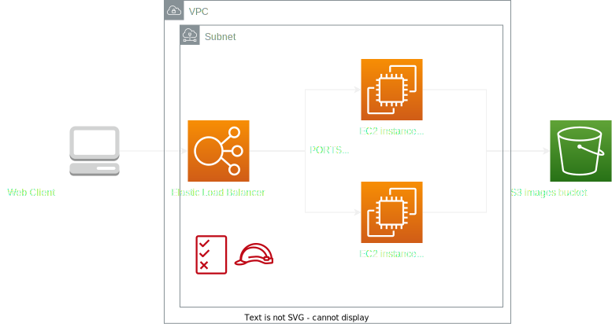

# NUWE-Zurich-Cloud-Hackathon
This repository contains all the files needed to start the on site phase of the NUWE x Zurich Cloud Challenge.

# Report
This is the report of the challenge. It's been created for documentation purposes, although the implementation has not yet been finished and the presented solution is not yet working.

## 🎯 Objective
Design and implement a comprehensive infrastructure as code (IaC) project with scalable EC2 instances, a local CI/CD pipeline using Jenkins and Gogs, and efficient image upload to an S3 bucket. Validate IaC changes, trigger deployments as necessary, and create a professional report for stakeholders, providing design insights, decision explanations, and conclusive outcomes.

<br>

## 🏛️ Architecture
The architecture for this challenge is simple. Customer connects to a web client via AWS elastic load balancer, which distributes the traffic through available ec2 instances.

<p align="center">
    
</p>

Considering that the EC2 instances should be always available, the reserved instances provisioning option has been chosen.

Although alternatively we could store the static website on S3 and then send images to another bucket via lambda, this challenge enforced the usage of EC2. This approach would be much cheaper.

<br>

## CI/CD

The deployment process involves Gogs software to create local git repository on docker. Pushes to this repository trigger jenkins pipeline job which verifies if the deployed code is valid. If it is and it differs from the existing state, Jenkins deploys the code to AWS.

<p align="center">
    
</p>

<br>

## 🏗️ Terraform
The infrastructure stack is created using Terraform, following best practices for naming conventions, code structure, and AWS architecture. The code is modular and reusable.

<br>

## ✅ Testing
For infrastructure testing, Jenkins has been used. If code is valid, it is being deployed to AWS. As per functionality, manual tests has been performed. Additional automatic testing could be implemented as a Jenkins pipeline. For that purpose we would upload an image via website and we would check if it appears on S3 bucket.

<br>

## 🚀 How to run
To run the application, follow these steps:

### Install and run

1. Run `bash ./auto-install.sh` to install all the dependencies
1. Install the Terraform local provider by running pip install terraform-local.
1. Make sure you have ~/.aws/credentials file with the following content:
```
[default]
aws_access_key_id = fake
aws_secret_access_key = fake
```
and ~/.aws/config file with the following content:
```
[default]
region = us-east-1
output = json
```
1. Run ```docker compose up``` to create three serivces.
    1. Gogs self hosted git service
    1. Jenkins service
    1. Localstack
1. Navigate to the Terraform folder using `cd ./src/terraform`.
1. Initialize Terraform by running `tflocal init`.
1. Apply the Terraform configuration by running `tflocal apply`.

You can access the LocalStack dashboard at `https://app.localstack.cloud/dashboard/` and interact with the local AWS resources at `http://localhost:4566/`.

### Configure Gogs

1. Create a local developer account
1. Create a local repository
1. Run ```git remote add origin <Gogs local address>/<Gogs repo name>```
1. Add ```LOCAL_NETWORK_ALLOWLIST = *``` to app.ini for gogs

### Configure Jenkins

1. Create Admin account for Jenkins
1. Install the following plugins
    1. Git
    1. Docker
    1. Docker Pipeline
    1. Terraform
1. Create a job in Jenkins
1. Add SCM option pointing to your Gogs repository

### Configure web hooks for repository
In your Gogs repository configure your webhook to point to ```http://\<jenkins local address>/gogs-webhooks/?job=\<jenkins job name>```